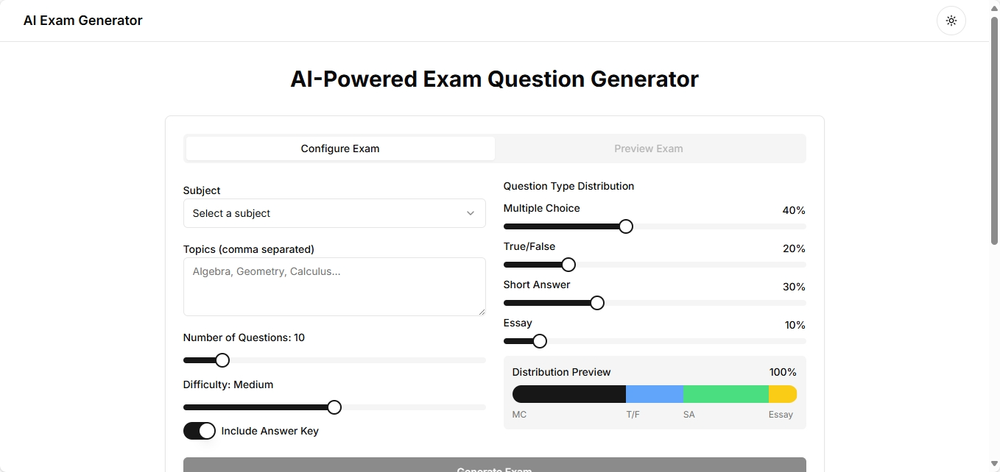

# 🧠 AI-Powered Exam Generator

A modern, AI-powered exam creation tool built with **Next.js**, **TailwindCSS**, and **Google Generative AI**. Generate custom exams in seconds and export them effortlessly.


## ✨ Features

* 🤖 **AI-Generated Questions** – Uses Google Gen AI to dynamically craft exam questions.
* 📄 **Export to Document** – Easily export exams into downloadable documents.
* 🛠️ **Diagnostics Tool** – Verify availability and status of required AI models.
* 🧩 **Interactive UI** – Built with modular and accessible components (ShadCN UI).


## 📁 Directory Structure

```bash
brayanj4y-ai-powered-exam-generator/
├── app/
│   ├── globals.css
│   ├── layout.tsx
│   ├── page.tsx
│   └── api/
│       ├── check-models/
│       │   └── route.ts
│       └── export-exam/
│           └── route.ts
├── components/
│   ├── *.tsx
│   └── ui/
├── hooks/
│   ├── use-mobile.tsx
│   └── use-toast.ts
├── lib/
│   ├── check-models.ts
│   ├── document-generator.ts
│   ├── google-ai-client.ts
│   ├── question-generator.ts
│   └── utils.ts
├── styles/
│   └── globals.css
├── public/
```


## 🚀 Getting Started

### ✅ Prerequisites

* 🟢 Node.js >= 18
* 🔑 Google Gen AI API key

### 📦 Installation

```bash
npm install
```

### 🧪 Development

```bash
npm run dev
```


## 🔐 Environment Variables

Create a `.env.local` file in the root:

```bash
GOOGLE_API_KEY=your_google_gen_ai_api_key
```

## 🤝 Contribution

Contributions are very welcome! Fork, branch, and submit a PR 🚀


## 📄 License

[MIT](./LICENSE)

---
Built with 💛 by [@brayanj4y](https://github.com/brayanj4y).

